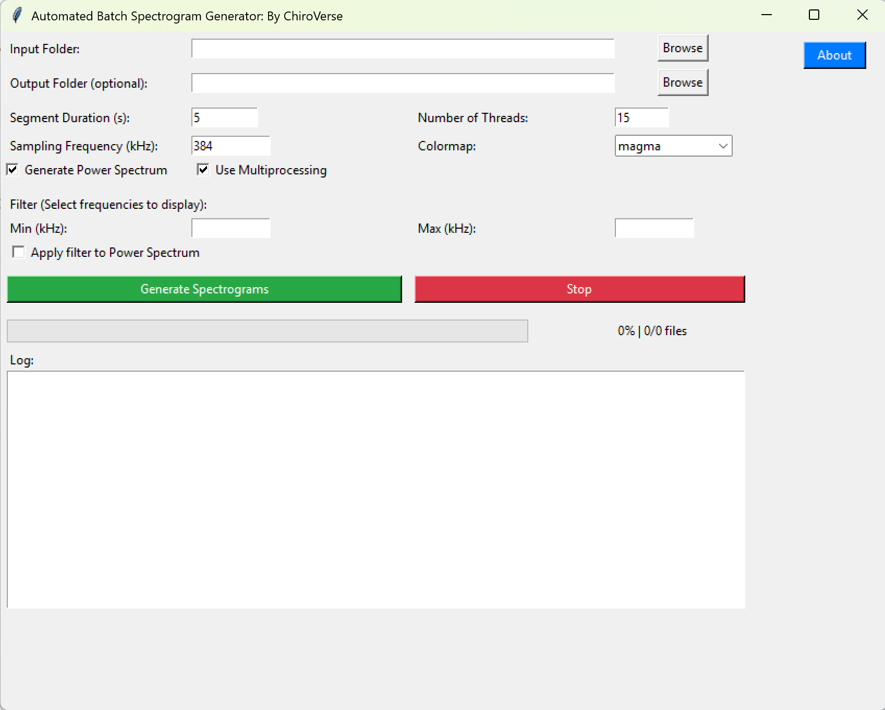
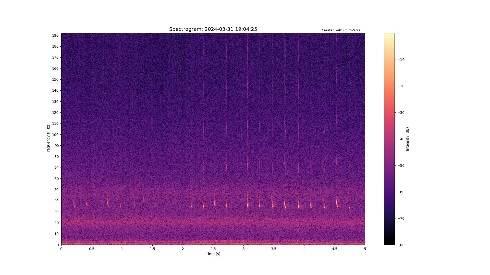

# BatSpectroGen_ChiroVerse
## Automated Batch Spectrogram Generator

This software lets users create **spectrograms** and **power spectrum images** by **batch processing** `.wav` audio files using a simple graphical interface.  
It is designed to be **easy for non-programmers** and works on **Windows, macOS, and Linux**.  
Ideal for **bioacoustics, bat call analysis, and wildlife sound monitoring**.

Cite as:                                                                                                                                                                                             
```bash
Barje, V. & Deshpande, K. 2025.                                                                                                                                                                      
ChiroVerse/BatSpectroGen_ChiroVerse: v1.0.0                                                                                                                                                          
GitHub Repo: https://github.com/ChiroVerse/BatSpectroGen_ChiroVerse
https://doi.org/10.5281/zenodo.17397285
```                                                                                                                                               
[](https://doi.org/10.5281/zenodo.17397284)

LICENSE: http://creativecommons.org/licenses/by-nc-sa/4.0/

---

## 📌 Features
- Simple **double-click launch** – no coding required.
- Process `.wav` files in batches with a **graphical interface (GUI)**.
- Adjustable **segment duration**, **sampling frequency**, and **colormap**.
- Optional **power spectrum** generation for each file.
- **Filtering** options for frequency ranges.
- **Multiprocessing** for faster batch analysis.
- Progress bar, log window, and error handling built in.
- Designed for **bat ultrasonic calls** (default settings) but can be used for audio files of **all other taxa** too by changing specific settings.

---

## ⚙️ System Requirements
- **Operating System**: Windows, macOS, or Linux  
- **Python Version**: 3.9 or above  
- **CPU**: Multi-core processor recommended for speed  

---

## 🚀 Installation & Setup

### Step 1 – Install Python
- Download and install **Python 3.9+** from [python.org/downloads](https://www.python.org/downloads/).  
- During installation on **Windows**, make sure to tick **“Add Python to PATH”**.  
- On **macOS**, Python comes pre-installed, but it is recommended to update to the latest version.  
- On **Linux**, use your package manager (see below).

### Step 2 – Get the Program
Download this repository as a **ZIP file** or clone it via Git.

Unzip (if downloaded as ZIP) and keep all files together.

### Step 3 – Run the Program
- **Windows**: Simply **double-click** the file `AutomatedSpectrogramGUI.py`.
- When launching the app for the first time, it will download the necessary dependencies and then start once the installation is complete.
- **macOS**: Right-click the file → choose **“Open With” → Python Launcher** (instead of opening in a text editor).  
- **Linux**: Right-click the file → choose **“Run with Python”**, or run from terminal with:
  ```bash
  python3 BatSpectroGen_ChiroVerse.py
  ```

⚠️ **Note for users whose system opens Python files in a text editor (e.g. VS Code, IDLE, Notepad++):**  
- Instead of double-clicking, open a terminal/command prompt.  
- Navigate to the folder containing the script, then run:
  ```bash
  python BatSpectroGen_ChiroVerse.py
  ```
  (or `python3` on macOS/Linux).

---

## 🖥️ Using the GUI



- **Input Folder** → Select the folder containing `.wav` audio files.  
- **Output Folder (optional)** → Choose destination folder. If left blank, a folder named `Automated_Spectrogram_[inputfolder]` is created.  
- **Segment Duration (s)** → Length of each segment (default: 5).  
- **Number of Threads** → Choose number of CPU threads (default: system cores – 1).  
- **Sampling Frequency (kHz)** → Default: 384 kHz.  
- **Colormap** → Choose from `viridis`, `bone`, `YlGnBu`, `magma`, `Greys`.
  
- **Generate Power Spectrum** → Saves extra image with energy distribution.  
- **Use Multiprocessing** → Enable for faster batch processing.  
- **Filters** → Optionally select frequency range (min/max in kHz).  

**Buttons**:
- ✅ **Generate Spectrograms**: Starts processing  
- ⛔ **Stop**: Halts processing  
- ℹ️ **About**: Program info and credits  

---

## 📊 Output



- Each `.wav` file creates:
  - A **subfolder** named after the file.
  - Spectrogram images (`.jpg`).
  - (Optional) Power spectrum plots.  

---

## 🔧 Troubleshooting
- **No `.wav` files found** → Check your input folder path.  
- **Invalid values** → Only use numbers for duration, threads, and frequency.  
- **Filter errors** → Ensure Min < Max frequency.  
- If the program doesn’t open on double-click, try the **alternative launch method** (see above).  
- Check the **log window** for error messages.  

---

## 👥 Credits & Support
Created by **ChiroVerse**  

- **Vedant Barje**
- **Kadambari Deshpande**

  Get in touch: [connect.chiroverse@gmail.com](mailto:connect.chiroverse@gmail.com) 

Supported by:  
- **Indian Institute for Human Settlements (Bengaluru)**  
- **Wildlife Conservation Trust (Mumbai)**  

Automated_Batch_Spectrogram_Generator © 2025 by Vedant Barje and Kadambari Deshpande is licensed under CC BY-NC-SA 4.0
https://creativecommons.org/licenses/by-nc-sa/4.0/deed.en

---
