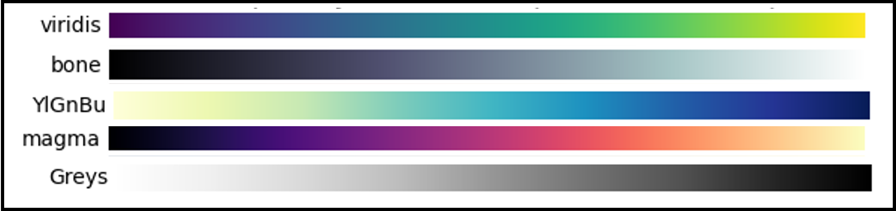
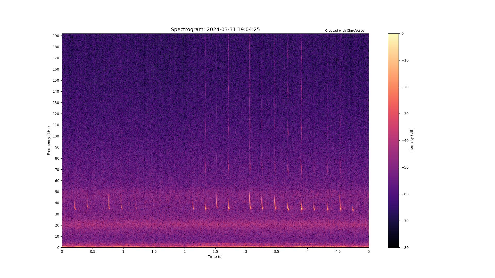

# BatSpectroGen
## Batch spectrogram generation for bat and wildlife recordings

BatSpectroGen turns a folder of `.wav` recordings into spectrogram images through a simple desktop window. It was developed for bat acoustics, bioacoustics and wildlife sound monitoring. After the one-time setup, no programming is needed.

BatSpectroGen works on Windows, macOS and Linux. It supports Python 3.9 through 3.13 and includes a low-memory option for older or less powerful computers.

### Citation

```text
Barje, V. & Deshpande, K. 2025.
BatSpectroGen, ChiroVerse.
GitHub: https://github.com/ChiroVerse/BatSpectroGen_ChiroVerse
https://doi.org/10.5281/zenodo.17397285
```

[](https://doi.org/10.5281/zenodo.17397284)

License: [CC BY-NC-SA 4.0](https://creativecommons.org/licenses/by-nc-sa/4.0/)

---

## What BatSpectroGen does

- Processes a folder of WAV recordings in one batch.
- Reads the sampling rate from each recording without resampling the audio.
- Splits recordings into spectrograms of a selected duration.
- Keeps a shorter final segment instead of discarding it.
- Provides low-memory, balanced and high-detail profiles.
- Allows the displayed frequency range and colormap to be selected.
- Can produce an average power-spectrum image for each recording.
- Can process several recordings at once on computers with enough memory.

---

## Before installing

- Use Windows 10/11, a current macOS release, or a modern Linux distribution.
- Install 64-bit Python 3.9, 3.10, 3.11, 3.12 or 3.13.
- Keep the downloaded BatSpectroGen files together in one folder.
- Internet access is needed during the first setup.

For a workshop or first run, use the **Balanced** profile, one thread and leave multiprocessing switched off.

---

## Installation

Download the repository with **Code → Download ZIP**, then extract the ZIP file.

### Windows

1. Install Python from [python.org/downloads](https://www.python.org/downloads/) and select **Add Python to PATH** during installation.
2. Double-click `Install_BatSpectroGen_Windows.bat` once.
3. Double-click `Run_BatSpectroGen_Windows.bat` whenever you want to start BatSpectroGen.

### macOS

Install Python 3.9-3.13 from [python.org/downloads](https://www.python.org/downloads/) if needed. Open Terminal in the BatSpectroGen folder and run:

```bash
chmod +x Install_BatSpectroGen_macOS_Linux.sh Run_BatSpectroGen_macOS_Linux.sh
./Install_BatSpectroGen_macOS_Linux.sh
./Run_BatSpectroGen_macOS_Linux.sh
```

### Linux

Install Python, Tk and `libsndfile` first. On Ubuntu or Debian:

```bash
sudo apt update
sudo apt install python3 python3-venv python3-tk libsndfile1
chmod +x Install_BatSpectroGen_macOS_Linux.sh Run_BatSpectroGen_macOS_Linux.sh
./Install_BatSpectroGen_macOS_Linux.sh
./Run_BatSpectroGen_macOS_Linux.sh
```

Setup creates a private `.venv` inside the BatSpectroGen folder. It does not replace other Python packages on the computer.

---

## Using BatSpectroGen

- **Input Folder**: select the folder that directly contains the WAV recordings.
- **Output Folder (optional)**: select a new or empty folder. If left blank, BatSpectroGen creates `BatSpectroGen_Output_<input folder>` beside the recordings.
- **Segment Duration (s)**: number of seconds represented by each spectrogram. Use 5 seconds for the workshop unless instructed otherwise.
- **Processing Profile**: controls output resolution and memory use.
  - `low-memory`: 1600 × 900, smaller FFT, one file at a time.
  - `balanced`: 1920 × 1080; recommended for most users.
  - `high-detail`: 3840 × 2160; slower and more demanding.
- **Number of Threads**: used only when **Use Multiprocessing** is selected.
- **Generate Power Spectrum**: produces one image showing how acoustic energy is distributed across frequencies in each recording.
- **Min / Max (kHz)**: changes the displayed frequency range. It does not filter or alter the audio.
- **Colormap**: changes the colours used in the spectrogram.



Select **Generate Spectrograms** to begin. The output folder must be empty so that results made with different settings are not mixed.

---

## Output



Each recording receives its own output subfolder containing:

- timestamped spectrogram images (`.jpg`);
- an optional average power-spectrum image.

BatSpectroGen does not create a CSV manifest or JSON run summary.

---

## For low-power computers

- Select **Low-memory**.
- Use one thread and leave multiprocessing off.
- Turn off the power spectrum if it is not needed.
- Close other applications while processing.
- Avoid writing output directly into a synchronised cloud folder.

Use **High-detail** only when the additional resolution is needed and the computer has enough memory and disk space.

---

## Troubleshooting

- **BatSpectroGen does not open:** run the appropriate install file first.
- **No WAV files found:** select the folder that directly contains the recordings.
- **Output folder is not empty:** choose a new folder or move the earlier results elsewhere.
- **Frequency-range error:** Min must be lower than Max, and Max cannot exceed half the recording's sampling rate.
- **The computer becomes slow:** use Low-memory, one thread and no multiprocessing.
- **macOS blocks a script:** right-click it and choose **Open**, or allow it in Privacy & Security settings.
- **Linux reports a Tk error:** install `python3-tk` for the active Python installation.

The workshop folder also includes `BatSpectroGen_Manual.pdf` with the same instructions in a printable format.

---

## Credits and support

BatSpectroGen was created by **Vedant Barje** and **Kadambari Deshpande**, ChiroVerse.

Contact: [connect.chiroverse@gmail.com](mailto:connect.chiroverse@gmail.com)

Supported by:

- Indian Institute for Human Settlements, Bengaluru
- Wildlife Conservation Trust, Mumbai

BatSpectroGen © 2025 Vedant Barje and Kadambari Deshpande. Licensed under [CC BY-NC-SA 4.0](https://creativecommons.org/licenses/by-nc-sa/4.0/deed.en).
